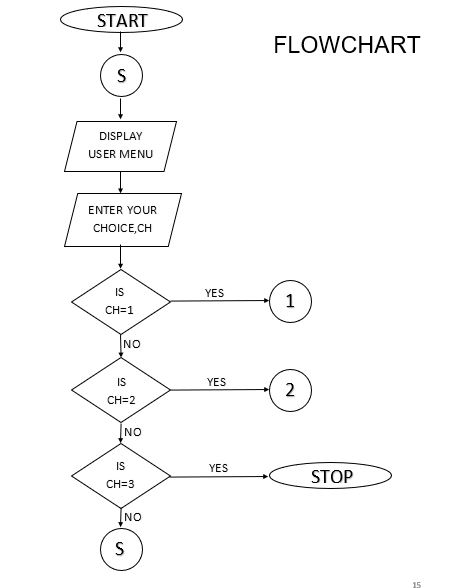
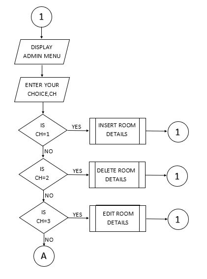
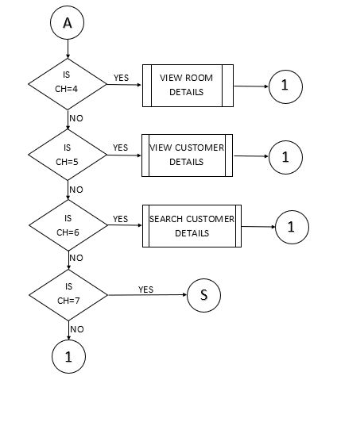
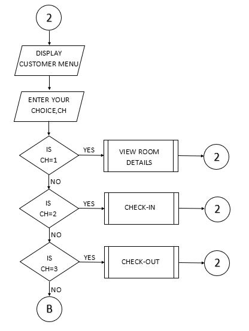
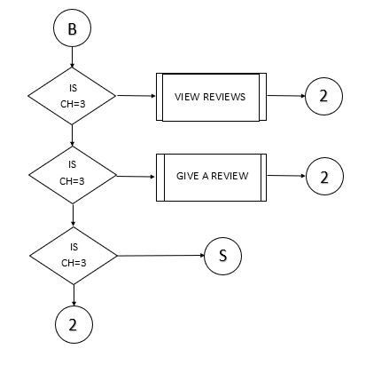

# Seven Seas Grand Hotel Management System

Welcome to the Seven Seas Grand Hotel Management System! This program allows you to manage various aspects of the hotel, including room details, customer information, and reviews. You can perform administrative tasks as well as customer-related functions. Below, you'll find information on how to use the program and its features.

## Features

1. **Admin Options**

   As an administrator, you have access to various functions for managing the hotel. To access admin options, you need to enter the correct password.

   - **Input Room Details:** Add details of new rooms, including size, availability status, and cost per night.
   - **Delete Room Details:** Remove a room from the system.
   - **Edit Room Details:** Modify room details such as size, availability status, and cost.
   - **Show Room Details:** Display a list of all rooms along with their details.
   - **Show Customer Details:** View a list of customers along with their booking and check-out information.
   - **Search Customer Details:** Find detailed information about a specific customer.
   - **Exit Admin Options:** Return to the main menu.

2. **Customer Options**

   If you're a customer, you can use these functions to interact with the hotel.

   - **Check Available Rooms:** Display a list of available rooms with their details.
   - **Check In:** Reserve a room by entering your name and selecting an available room.
   - **Check Out:** Check out from your reserved room, calculate the bill, and view the total cost.
   - **Give Review:** Share your experience by leaving a review.
   - **Check Reviews:** View reviews given by other customers.
   - **Exit Customer Options:** Return to the main menu.

3. **Exit Program**

   Exit the program safely by confirming your choice.

## Flowchart

Here's a visual representation of the program's logic:

## How to Run

1. Ensure you have Python installed on your system.
2. Copy and paste the provided code into a Python file (e.g., `hotel_management.py`).
3. Run the Python script using the command `python hotel_management.py`.

## Notes

- This program demonstrates basic hotel management functions and is intended for educational purposes.
- Keep the password "S3V3NS3AS" handy to access the admin options.